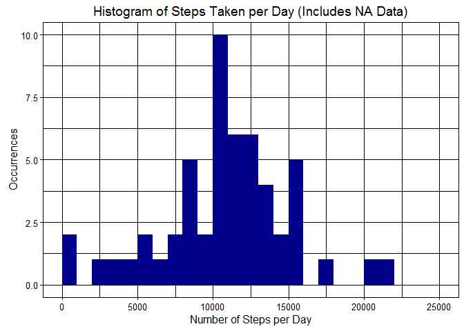
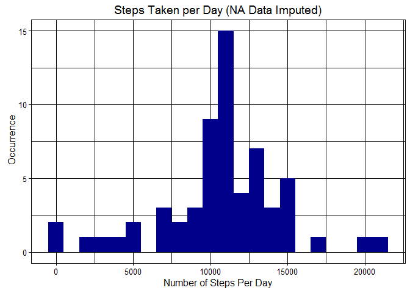
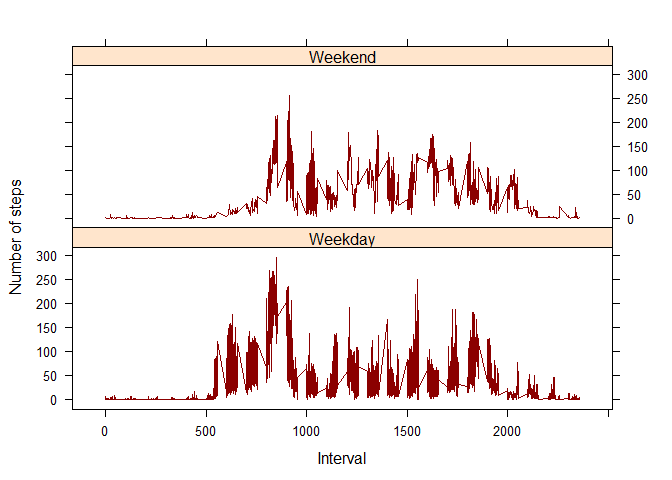

# Reproducible Research: Peer Assessment 1


## Loading and preprocessing the data
Information for the study was provided in a comma delimted file, activities.csv and contains fields for steps taken, date and interval number for the date. The information is read into the r plaform as a data frame and the appropriate libraries are loaded. 

```r
stepsData <- read.csv('activity.csv')
library(ggplot2)
```


## What is mean total number of steps taken per day?

 1. What is the total number of steps per day (shown by histogram)
 2. Calculate and report the mean and median steps taken per day


```r
sumSteps <-  aggregate(steps ~ date, stepsData, sum)
ggplot(sumSteps, aes(x = steps)) +  geom_histogram(fill = "darkblue", breaks=seq(0,25000,by=1000)) + 
labs(title="Histogram of Steps Taken per Day (Includes NA Data)", x = "Number of Steps per Day", y = "Occurrences") + theme_linedraw()
```

<!-- -->

```r
mean1 <- round(mean(sumSteps$steps),0)
median1 <- round(median(sumSteps$steps),0)
print(paste('Mean steps per day',mean1,'Median steps per day',median1))
```

```
## [1] "Mean steps per day 10766 Median steps per day 10765"
```

## What is the average daily activity pattern?
1. Show a time series plot of the 5 minute interval and average number of steps taken averaged across all days
2. Which 5 minute interval on average across all days in the dataset contains the maximum number of steps?


```r
stepsInterval <- aggregate(steps ~ interval, stepsData, mean)

plot(stepsInterval$interval,stepsInterval$steps, type="l", xlab="Interval", ylab="Number of Steps",main="Average Number of Steps per Day by Interval",col = 'red')
```

<!-- -->

```r
maxInterval <- stepsInterval[which.max(stepsInterval$steps),1]
print(paste("The interval with the maximum steps on average is ",maxInterval))
```

```
## [1] "The interval with the maximum steps on average is  835"
```


## Imputing missing values

Several days/intervals in the activity dataset are missing values (coded as NA). The presence of missing days may introduce bias into some calculations or summaries of the data so must be imputed. The strategy for imputing data is to replace NA values with the mean value of the interval where values are missing for all other days.

```r
missingValues <- sum(!complete.cases(stepsData))
print(paste(missingValues,' records have incomplete information'))
```

```
## [1] "2304  records have incomplete information"
```

```r
imputedStepsData <- transform(stepsData,steps = 
     ifelse(is.na(stepsData$steps),stepsInterval$steps[match(stepsData$interval,stepsInterval$interval)],stepsData$steps))

imputedSumSteps <- aggregate(steps ~ date, imputedStepsData, sum)

ggplot(imputedSumSteps, aes(x = steps)) + geom_histogram(fill = "darkblue",binwidth = 1000) + 
labs(title="Steps Taken per Day (NA Data Imputed)", x = "Number of Steps Per Day", y = " Occurrence") + theme_linedraw()
```

<!-- -->

```r
mean2 <- round(mean(imputedSumSteps$steps),0)
median2 <- round(median(imputedSumSteps$steps),0)
print(paste(mean2," ",median2))
```

```
## [1] "10766   10766"
```

## Are there differences in activity patterns between weekdays and weekends?


```r
imputedStepsData$date <- as.POSIXct(imputedStepsData$date, format="%Y-%m-%d")

imputedStepsData$dow <- weekdays(imputedStepsData$date)
imputedStepsData$dayType <- ifelse(imputedStepsData$dow == "Saturday" | 
            imputedStepsData$dow == "Sunday", "Weekend", "Weekday")

library(lattice)

# Compute the average number of steps taken, averaged across all daytype variable
meanInfo <- aggregate(imputedStepsData$steps, by=list(imputedStepsData$dayType, imputedStepsData$dow, imputedStepsData$interval), mean)

# Rename the attributes
names(meanInfo) <- c("dayType", "dayOfWeek", "interval", "mean")
xyplot(mean ~ interval | dayType, meanInfo, 
       type="l", 
       lwd=1, 
       xlab="Interval", 
       ylab="Number of steps",
       col = "darkred",
       layout=c(1,2))
```

<!-- -->
